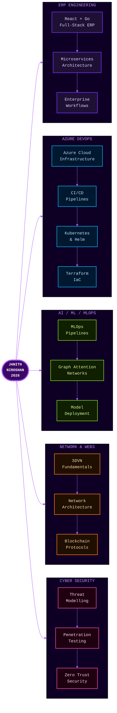

<!--
███╗   ██╗███████╗██████╗  ██████╗  ██╗     ██╗ ██╗███╗   ██╗
████╗  ██║██╔════╝██╔══██╗██╔═══██╗ ██║     ██║ ██║████╗  ██║
██╔██╗ ██║█████╗  ██████╔╝██║   ██║ ██║     ██║ ██║██╔██╗ ██║
██║╚██╗██║██╔══╝  ██╔══██╗██║   ██║ ██║██   ██║ ██║██║╚██╗██║
██║ ╚████║███████╗██║  ██║╚██████╔╝ ██║╚█████╔╝ ██║██║ ╚████║
╚═╝  ╚═══╝╚══════╝╚═╝  ╚═╝ ╚═════╝  ╚═╝ ╚════╝  ╚═╝╚═╝  ╚═══╝
-->

<!-- ━━━━━━━━━━━━━━━━━━━━━━━━━━━━━━━━━━━━━━━━━━━━━━━━━━━━━━━━━━━━━━━━━ -->
<!--  SECTION 01 — CINEMATIC ENTRY                                      -->
<!-- ━━━━━━━━━━━━━━━━━━━━━━━━━━━━━━━━━━━━━━━━━━━━━━━━━━━━━━━━━━━━━━━━━ -->

<div align="center">


</div>

<div align="center">

[](https://git.io/typing-svg)

</div>

<br>

<div align="center">

[](https://twitter.com/_itz_nero)
[](https://linkedin.com/in/janith-niroshan)
[](https://instagram.com/_itz_nero)
[](https://yourportfolio.com)
[](mailto:your.email@example.com)

&nbsp;


&nbsp;

&nbsp;


</div>

<br>


<!-- ━━━━━━━━━━━━━━━━━━━━━━━━━━━━━━━━━━━━━━━━━━━━━━━━━━━━━━━━━━━━━━━━━ -->
<!--  SECTION 02 — IDENTITY TERMINAL                                     -->
<!-- ━━━━━━━━━━━━━━━━━━━━━━━━━━━━━━━━━━━━━━━━━━━━━━━━━━━━━━━━━━━━━━━━━ -->

<br>

<table align="center" border="0" width="96%">
<tr>
<td width="52%" valign="top">

```bash
╔══════════════════════════════════════════════╗
║         SYSTEM BOOT — neroIJN v2026          ║
╠══════════════════════════════════════════════╣
║ > whoami                                     ║
║   Janith Niroshan                            ║
║   Inter Software Engineer @ IFS R&D Intl.   ║
║   Sri Lanka  🇱🇰                             ║
║                                              ║
║ > cat current_role.txt                       ║
║   Building enterprise ERP systems            ║
║   working on cutting-edge R&D products       ║
║   that power Fortune 500 companies.          ║
║                                              ║
║ > ls ./superpowers                           ║
║   react/  golang/  azure/  devops/           ║
║   mlops/  blockchain/  cybersec/  ai/        ║
║                                              ║
║ > echo $PHILOSOPHY                           ║
║   "I don't just write code.                  ║
║    I architect systems that outlast trends." ║
║                                              ║
║ > uptime                                     ║
║   Shipping production code since 2021        ║
║   Status: ONLINE ██████████ 100%            ║
╚══════════════════════════════════════════════╝
```

</td>
<td width="48%" align="center" valign="middle">


<br>


<br>


</td>
</tr>
</table>

<br>


<!-- ━━━━━━━━━━━━━━━━━━━━━━━━━━━━━━━━━━━━━━━━━━━━━━━━━━━━━━━━━━━━━━━━━ -->
<!--  SECTION 03 — TECH ARSENAL                                          -->
<!-- ━━━━━━━━━━━━━━━━━━━━━━━━━━━━━━━━━━━━━━━━━━━━━━━━━━━━━━━━━━━━━━━━━ -->

<br>

<h2 align="center">
  
  &nbsp; Tech Arsenal &nbsp;
  
</h2>

<div align="center">

<table border="0" cellpadding="12">
<tr>
<td align="center">

**`⚡ LANGUAGES`**
<br>


</td>
<td align="center">

**`🎨 FRONTEND`**
<br>


</td>
</tr>
<tr>
<td align="center">

**`⚙️ BACKEND`**
<br>


</td>
<td align="center">

**`🗄️ DATABASES`**
<br>


</td>
</tr>
<tr>
<td align="center">

**`☁️ CLOUD & DEVOPS`**
<br>


</td>
<td align="center">

**`🛠️ TOOLCHAIN`**
<br>


</td>
</tr>
</table>

</div>

<br>


<!-- ━━━━━━━━━━━━━━━━━━━━━━━━━━━━━━━━━━━━━━━━━━━━━━━━━━━━━━━━━━━━━━━━━ -->
<!--  SECTION 04 — GITHUB ANALYTICS                                      -->
<!-- ━━━━━━━━━━━━━━━━━━━━━━━━━━━━━━━━━━━━━━━━━━━━━━━━━━━━━━━━━━━━━━━━━ -->

<br>

<h2 align="center">
  
  &nbsp; GitHub Analytics &nbsp;
  
</h2>

<div align="center">


</div>

<br>

<div align="center">

</div>

<br>

<div align="center">

</div>

<br>

<div align="center">

</div>

<br>

<div align="center">


</div>

<br>


<!-- ━━━━━━━━━━━━━━━━━━━━━━━━━━━━━━━━━━━━━━━━━━━━━━━━━━━━━━━━━━━━━━━━━ -->
<!--  SECTION 05 — FEATURED PROJECTS                                     -->
<!-- ━━━━━━━━━━━━━━━━━━━━━━━━━━━━━━━━━━━━━━━━━━━━━━━━━━━━━━━━━━━━━━━━━ -->

<br>

<h2 align="center">
  
  &nbsp; Featured Projects &nbsp;
  
</h2>

<div align="center">

[](https://github.com/neroIJN/POS)
&nbsp;&nbsp;
[](https://github.com/NirangaNiluminda/NewLearningApp)

</div>

<br>

<table align="center" border="0" width="92%">
<tr>
<td align="left" width="50%">

> **`💰` Advanced POS System**
>
> Next-gen Point of Sale platform on a microservices backbone — real-time inventory, analytics, RESTful APIs.
>
> `React` · `Node.js` · `MongoDB` · `Express` · `Docker`
>
> 

</td>
<td align="left" width="50%">

> **`🎓` Interactive Learning Platform**
>
> AI-powered adaptive learning — personalised paths, edge-runtime, optimistic UI, progress analytics.
>
> `Next.js` · `TypeScript` · `PostgreSQL` · `Prisma`
>
> 

</td>
</tr>
</table>

<br>


<!-- ━━━━━━━━━━━━━━━━━━━━━━━━━━━━━━━━━━━━━━━━━━━━━━━━━━━━━━━━━━━━━━━━━ -->
<!--  SECTION 06 — 2026 MISSION BOARD  ← THE SHOWSTOPPER                -->
<!-- ━━━━━━━━━━━━━━━━━━━━━━━━━━━━━━━━━━━━━━━━━━━━━━━━━━━━━━━━━━━━━━━━━ -->

<br>

<h2 align="center">
  
  &nbsp; 2026 Mission Board &nbsp;
  
</h2>

<div align="center">

```
╔══════════════════════════════════════════════════════════════════════════════╗
║                                                                              ║
║   "I don't follow trends.  I build the systems that set them."               ║
║                                                          — neroIJN, 2026     ║
║                                                                              ║
╚══════════════════════════════════════════════════════════════════════════════╝
```

</div>


```mermaid
%%{init:{'theme':'base','themeVariables':{'primaryColor':'#120030','primaryTextColor':'#e9d5ff','primaryBorderColor':'#7b2fff','lineColor':'#a855f7','secondaryColor':'#0a001f','tertiaryColor':'#06000f','clusterBkg':'#0e0025','titleColor':'#c084fc','nodeTextColor':'#e9d5ff','edgeLabelBackground':'#06000f','fontFamily':'monospace'}}}%%
graph LR
    ME(["JANITH\nNIROSHAN\n2026"]):::core

    ME --> ERP
    ME --> DEVOPS
    ME --> AI_ML
    ME --> NET
    ME --> SECURITY

    subgraph ERP ["ERP ENGINEERING"]
        direction TB
        E1["React + Go\nFull-Stack ERP"]:::node1
        E2["Microservices\nArchitecture"]:::node1
        E3["Enterprise\nWorkflows"]:::node1
        E1 --> E2 --> E3
    end

    subgraph DEVOPS ["AZURE DEVOPS"]
        direction TB
        D1["Azure Cloud\nInfrastructure"]:::node2
        D2["CI/CD\nPipelines"]:::node2
        D3["Kubernetes\n& Helm"]:::node2
        D4["Terraform\nIaC"]:::node2
        D1 --> D2 --> D3 --> D4
    end

    subgraph AI_ML ["AI / ML / MLOPS"]
        direction TB
        M1["MLOps\nPipelines"]:::node3
        M2["Graph Attention\nNetworks"]:::node3
        M3["Model\nDeployment"]:::node3
        M1 --> M2 --> M3
    end

    subgraph NET ["NETWORK & WEB3"]
        direction TB
        N1["SDVN\nFundamentals"]:::node4
        N2["Network\nArchitecture"]:::node4
        N3["Blockchain\nProtocols"]:::node4
        N1 --> N2 --> N3
    end

    subgraph SECURITY ["CYBER SECURITY"]
        direction TB
        S1["Threat\nModelling"]:::node5
        S2["Penetration\nTesting"]:::node5
        S3["Zero Trust\nSecurity"]:::node5
        S1 --> S2 --> S3
    end

    classDef core fill:#3b0764,stroke:#a855f7,stroke-width:4px,color:#ffffff,font-weight:bold,font-size:14px
    classDef node1 fill:#1e1035,stroke:#7b2fff,stroke-width:2px,color:#e9d5ff
    classDef node2 fill:#001830,stroke:#0ea5e9,stroke-width:2px,color:#bae6fd
    classDef node3 fill:#0f1f00,stroke:#84cc16,stroke-width:2px,color:#d9f99d
    classDef node4 fill:#1f0f00,stroke:#f97316,stroke-width:2px,color:#fed7aa
    classDef node5 fill:#1f0010,stroke:#ec4899,stroke-width:2px,color:#fbcfe8
```

<br>

<div align="center">

<table border="0" width="92%">
<tr>

<td align="center" width="20%">


`React` `Golang` `PostgreSQL`
`Microservices` `gRPC` `Docker`

**Status:** `In Progress`

</td>

<td align="center" width="20%">


`Azure` `Kubernetes` `Helm`
`Terraform` `CI/CD` `Monitoring`

**Status:** `Actively Learning`

</td>

<td align="center" width="20%">


`MLOps` `Graph Attention Networks`
`PyTorch` `Kubeflow` `MLflow`

**Status:** `Deep Dive`

</td>

<td align="center" width="20%">


`SDVN` `SDN` `Smart Contracts`
`DeFi` `Network Protocols`

**Status:** `Researching`

</td>

<td align="center" width="20%">


`Threat Modelling` `Pen Testing`
`Zero Trust` `SOC` `SIEM`

**Status:** `Exploring`

</td>

</tr>
</table>

</div>

<br>


<!-- ━━━━━━━━━━━━━━━━━━━━━━━━━━━━━━━━━━━━━━━━━━━━━━━━━━━━━━━━━━━━━━━━━ -->
<!--  SECTION 07 — WISDOM + CONNECT                                      -->
<!-- ━━━━━━━━━━━━━━━━━━━━━━━━━━━━━━━━━━━━━━━━━━━━━━━━━━━━━━━━━━━━━━━━━ -->

<br>

<div align="center">


> ***"The engineers who shape the future aren't the ones who know the most tools —***
> ***they're the ones who see the connections between them."***


<br><br>

### `./connect --all-channels`

[](https://twitter.com/_itz_nero)
[](https://linkedin.com/in/janith-niroshan)
[](https://instagram.com/_itz_nero)
[](mailto:your.email@example.com)
[](https://yourportfolio.com)

<br>

*ERP systems · Cloud-native infra · AI/ML research · Blockchain · Cyber Security*
<br>
*If it lives at the intersection of these — let's talk.*

</div>

<br>

<!-- ━━━━━━━━━━━━━━━━━━━━━━━━━━━━━━━━━━━━━━━━━━━━━━━━━━━━━━━━━━━━━━━━━ -->
<!--  FOOTER                                                              -->
<!-- ━━━━━━━━━━━━━━━━━━━━━━━━━━━━━━━━━━━━━━━━━━━━━━━━━━━━━━━━━━━━━━━━━ -->


