<div align="center">
  
</div>

<div align="center">

[](https://git.io/typing-svg)

</div>

<div align="center">
  
</div>

<div align="center">
  
  
  
  

</div>

<br>

<div align="center">
  
</div>

##  **ABOUT THE MATRIX ARCHITECT**


```typescript
interface DigitalArchitect {
  name: string;
  role: string[];
  location: string;
  languages: string[];
  architecture: {
    frontend: string[];
    backend: string[];
    database: string[];
    cloud: string[];
    devops: string[];
  };
  currentMission: string[];
  lifePhilosophy: string;
}

const janith: DigitalArchitect = {
  name: "Janith Niroshan",
  role: ["Digital Architect", "Code Alchemist", "AI Explorer"],
  location: "Sri Lanka 🇱🇰",
  languages: ["TypeScript", "Python", "JavaScript", "Java", "C++"],
  
  architecture: {
    frontend: ["React", "Next.js", "Vue.js", "Tailwind CSS"],
    backend: ["Node.js", "Express", "FastAPI", "Spring Boot"],
    database: ["MongoDB", "PostgreSQL", "Redis", "DynamoDB"],
    cloud: ["AWS", "Firebase", "Vercel", "Railway"],
    devops: ["Docker", "Kubernetes", "CI/CD", "Nginx"]
  },
  
  currentMission: [
    "🔥 Mastering AWS Cloud Architecture",
    "🤖 Deep diving into AI/ML ecosystems",
    "🚀 Building scalable distributed systems",
    "⚡ Exploring Web3 & blockchain technologies"
  ],
  
  lifePhilosophy: "Code is poetry, bugs are plot twists, and coffee is the compiler of life ☕✨"
};
```

<br>
<br>

##  **CONNECT ACROSS THE DIGITAL REALM**

<div align="center">
  
  <a href="https://twitter.com/_itz_nero">
    
  </a>
  <a href="https://linkedin.com/in/janith-niroshan">
    
  </a>
  <a href="https://fb.com/janithniroshan">
    
  </a>
  <a href="https://instagram.com/_itz_nero">
    
  </a>

</div>

<br>

<div align="center">
  
</div>

##  **GITHUB ANALYTICS DASHBOARD**

<div align="center">
  
  
</div>

<br/>

<div align="center">
  
  
</div>

<br/>

<div align="center">
  
</div>

<br>

##  **TROPHY COLLECTION**

<div align="center">
  
</div>

<br>

<div align="center">
  
</div>

##  **TECH ARSENAL & WEAPONRY**

<div align="center">

###  **Programming Languages**


###  **Frontend Arsenal**


###  **Backend Powerhouse**


###  **Database Kingdom**


###  **Cloud & DevOps**


###  **Tools & Environments**


</div>

<br>

<div align="center">
  
</div>

##  **FEATURED DIGITAL MASTERPIECES**

<div align="center">
  
  [](https://github.com/neroIJN/POS)
  [](https://github.com/NirangaNiluminda/NewLearningApp)

</div>

###  **Project Showcase**

<table align="center">
<tr>
<td align="center" width="50%">

**💰 Advanced POS System**
> *Next-gen Point of Sale Platform*

🚀 **Tech Stack**: React, Node.js, MongoDB, Express  
⚡ **Features**: Real-time inventory, Analytics dashboard  
🔥 **Highlights**: Microservices architecture, RESTful APIs

</td>
<td align="center" width="50%">

**🎓 Interactive Learning Platform**
> *AI-Powered Educational Experience*

🚀 **Tech Stack**: Next.js, TypeScript, PostgreSQL  
⚡ **Features**: Adaptive learning, Progress tracking  
🔥 **Highlights**: Modern UI/UX, Performance optimized

</td>
</tr>
</table>

<br>

##  **CURRENT LEARNING EXPEDITION**

<div align="center">



</div>

<br>

<div align="center">

###  **Learning Progress Tracker**

```mermaid
%%{init: {'theme':'dark', 'themeVariables': {'primaryColor': '#ff6b6b', 'primaryTextColor': '#ffffff', 'primaryBorderColor': '#ff6b6b', 'lineColor': '#ffffff', 'secondaryColor': '#ff6b6b', 'tertiaryColor': '#282828'}}}%%
graph TD
    A[🎯 2024 Learning Roadmap] --> B[☁️ AWS Cloud Mastery]
    A --> C[🤖 AI/ML Deep Dive]
    A --> D[🏗️ System Design Patterns]
    A --> E[⚡ Performance Optimization]
    
    B --> B1[Lambda Functions]
    B --> B2[ECS/EKS Orchestration]
    B --> B3[CloudFormation IaC]
    
    C --> C1[TensorFlow/PyTorch]
    C --> C2[Computer Vision]
    C --> C3[Natural Language Processing]
    
    D --> D1[Microservices Architecture]
    D --> D2[Event-Driven Systems]
    D --> D3[Distributed Databases]
    
    E --> E1[React Performance]
    E --> E2[Database Optimization]
    E --> E3[CDN & Caching Strategies]
```

| 🎯 **Skill Domain** | 📊 **Progress** | 🔥 **Current Focus** | 🚀 **Next Milestone** |
|:---:|:---:|:---:|:---:|
| **AWS Architecture** |  | Solutions Architect Cert | Pro-level certifications |
| **Machine Learning** |  | Deep Learning Models | Production ML Systems |
| **System Design** |  | Distributed Systems | Chaos Engineering |
| **DevOps Mastery** |  | Kubernetes Advanced | Service Mesh Implementation |

</div>

<br>

<div align="center">
  
</div>

##  **CODING ANALYTICS & INSIGHTS**

<div align="center">

### **⏰ Weekly Development Breakdown**
```text
TypeScript   ████████████████████████████████████████   95.2% 
Python       ███████████████████████████████████░░░░░   87.4%
JavaScript   ██████████████████████████████░░░░░░░░░░   76.8%
Go           ██████████████████████░░░░░░░░░░░░░░░░░░░   58.3%
Java         ████████████████░░░░░░░░░░░░░░░░░░░░░░░░░   42.1%
CSS/SCSS     ████████████░░░░░░░░░░░░░░░░░░░░░░░░░░░░░   31.7%
```

### **🔥 Productivity Metrics**


</div>

<br>

##  **GITHUB CONTRIBUTION SNAKE**

<div align="center">
  
  

</div>

<br>

<div align="center">
  
</div>

##  **INSPIRATION & MOTIVATION**

<div align="center">

###  **Daily Mantras**

> *"First, solve the problem. Then, write the code."* – **John Johnson**

> *"Code is like humor. When you have to explain it, it's bad."* – **Cory House**

> *"The best error message is the one that never shows up."* – **Thomas Fuchs**

### **🎧 Current Coding Playlist**

[](https://open.spotify.com/user/neroijn)

**🔥 Now Playing**: *Lo-fi Hip Hop Beats - Synthwave Nights - Epic Coding Sessions*

</div>

<br>

<div align="center">
  
</div>

##  **SPECIAL THANKS & ACKNOWLEDGMENTS**

<div align="center">

### **🙏 Grateful for the Journey**

*Special thanks to the amazing developer community, open source contributors, and everyone who has supported my coding journey. Every star ⭐, fork 🍴, and collaboration has made me a better developer.*

### **☕ Fuel for Coding**

*Powered by endless cups of coffee, late-night coding sessions, and an insatiable curiosity to build amazing things.*

</div>

<br>

<div align="center">
  
</div>

<div align="center">

### **🚀 Ready to Collaborate? Let's Connect!**

*Whether you want to discuss cutting-edge tech, collaborate on exciting projects, or just chat about the latest developments in AI and cloud computing – I'm always excited to connect with fellow innovators!*

[](mailto:your.email@example.com)
[](https://yourportfolio.com)
[](https://drive.google.com/your-resume)

---

 ***"Code with passion, debug with patience, and always keep learning!"*** 

</div>
